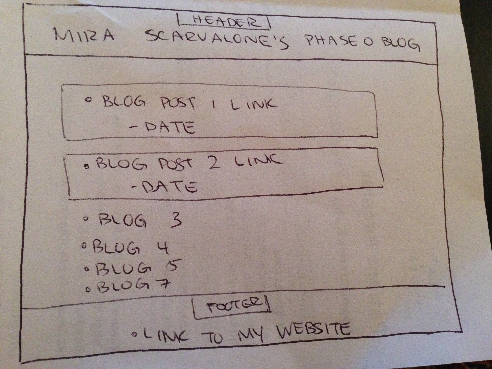
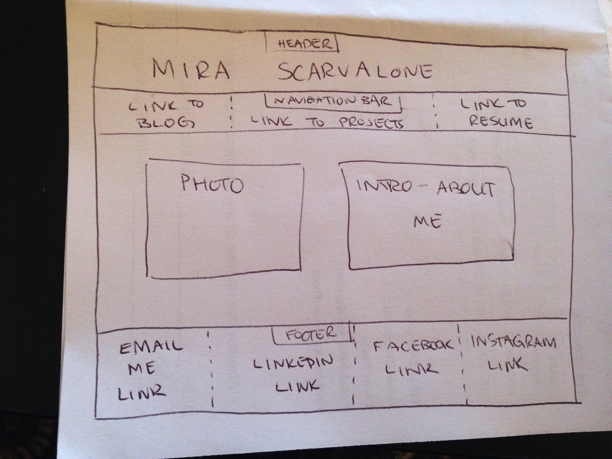

#What is a wireframe?
  A wireframe is a visual representation of the "skeleton" of a website. It's basically a plan of the website's layout and takes into account how the user is intended to interact with it.
#What are the benefits of wireframing?
  Wireframing allows an early consideration of what a website will look like and how a user will interact with it before other considerations are taken into account, like colors and text.
#Did you enjoy wireframing your site?
  I did! There is not a ton of material here so it didn't take much time (ie. there weren't a ton of pages to consider), but I did enjoy the process.
#Did you revise your wireframe or stick with your first idea?
  I revised my wireframe once to use a different layout. I changed the links at the top to be more about professional areas (like my projects, resume), and the links at the bottom to be more about generally contacting me and looking at my social profiles.
#What questions did you ask during this challenge? What resources did you find to help you answer them?
  First I asked what the purpose of this site would be and what its requirements were, which was included in the instructions. I also relied on the required reading to come up with some ideas for wireframes. I also looked at a friend's personal website to get an idea of how he laid out his sections of the page.
#Which parts of the challenge did you enjoy and which parts did you find tedious?
  It took me a long time to get the pictures to paste properly. This was a good lesson to learn, but meant I went way over the 1 hour to timebox, which was frustrating.