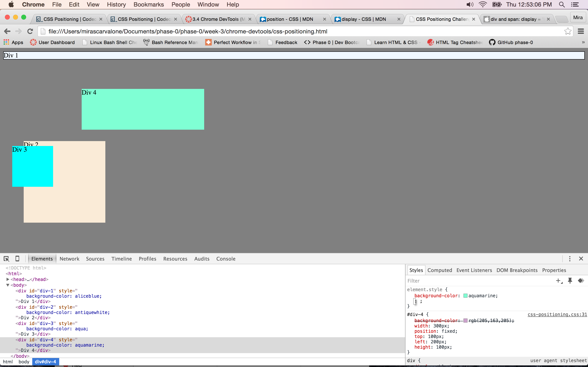
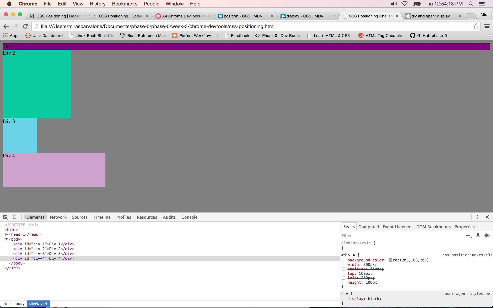
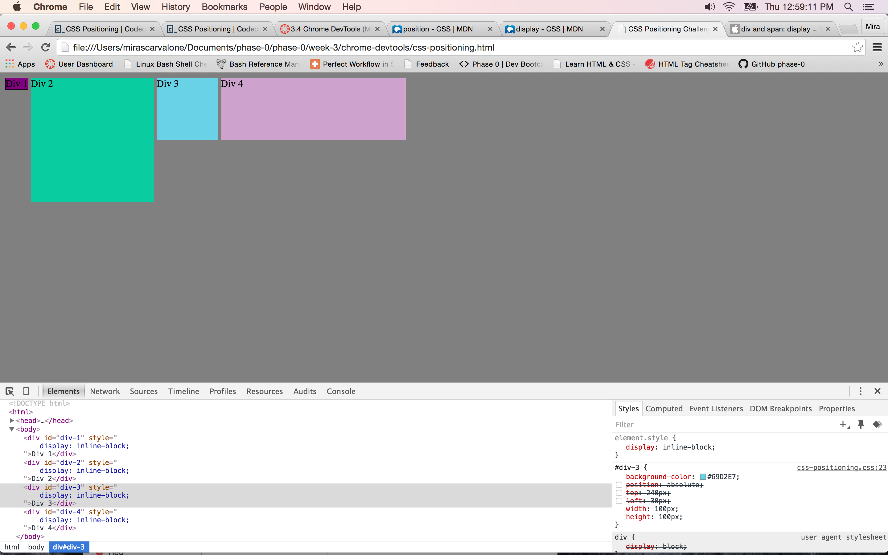
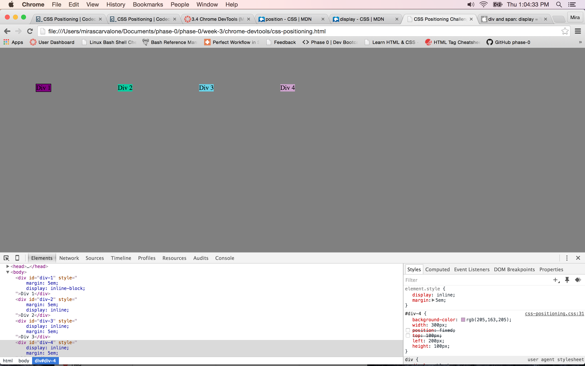
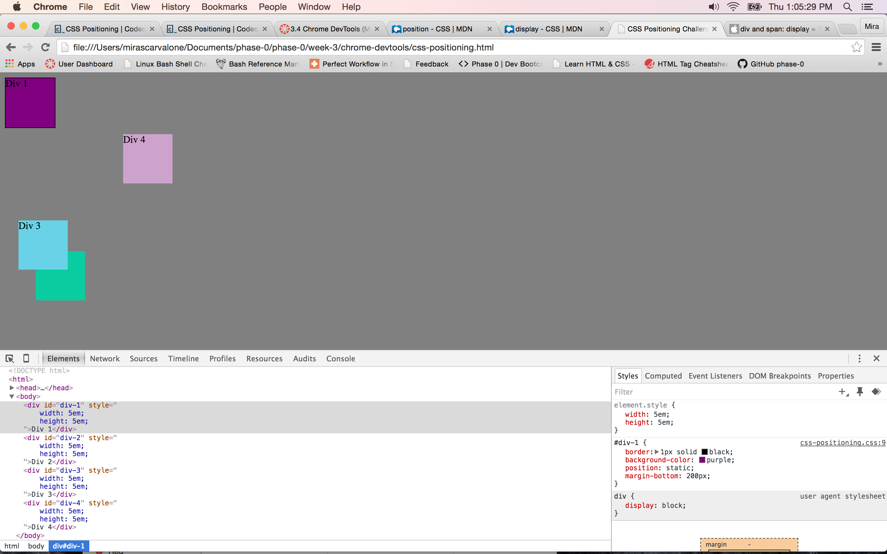
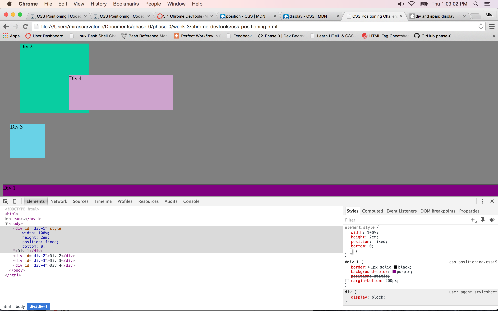
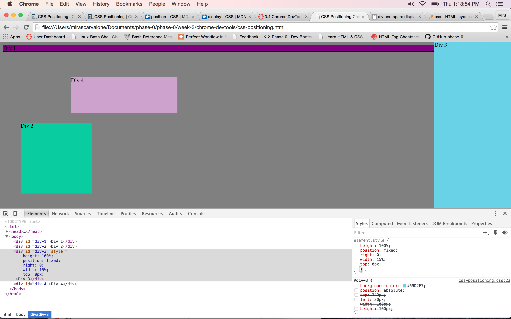
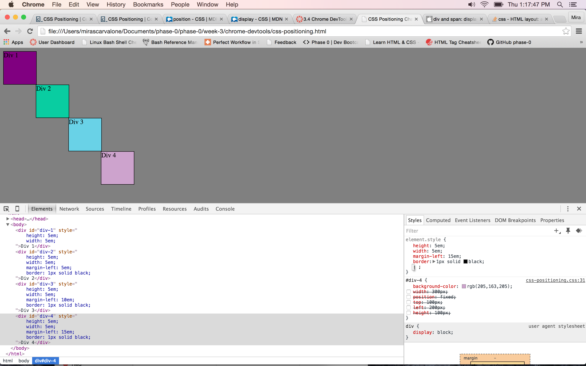

#How can you use Chrome's DevTools inspector to help you format or position elements?
  First, you can open Chrome's devTools inspector by right clicking on your page and selecting "Inspect Element." That opens a menu that shows both the HTML and relevant CSS code for each part of the HTML code. In this exercise, I learned that we can edit this CSS code to change the formatting or positioning of certain elements. First, click on the HTML element you'd like to edit, and then go over to the CSS. You can modify or delete existing CSS code, and add your own to change the formatting however you'd like.
#How can you resize elements on the DOM using CSS?
  Using the method I described above, you can edit the CSS corresponding to a particular element. To resize an element, you would edit the height and width properties.
#What are the differences between absolute, fixed, static, and relative positioning? Which did you find easiest to use? Which was most difficult?
  Absolute positioning moves an element relative to a parent element that does not have static positioning (if there is none, then relative to the html). Fixed positioning anchors an element to a particular part of the screen, regardless of scrolling or screen size adjustment. Static positioning is the default position, and relative positioning moves an element relative to where it would have been otherwise.
  I find fixed the easiest to use, because it's fairly intuitive. I am still struggling with fully understanding how to use absolute positioning.
#What are the differences between margin, border, and padding?
  Margin refers to the space around an element. The border is the edge of the element, and the padding is space between the content of an element and its border.
#What was your impression of this challenge overall? (love, hate, and why?)
  I really do not enjoy how much trial and error is involved in CSS formatting. It is frustrating but also not very intellectually stimulating. I do think this exercise is useful in getting us to learn more about CSS formatting by actually practicing it. I definitely know more now than before I started this challenge.