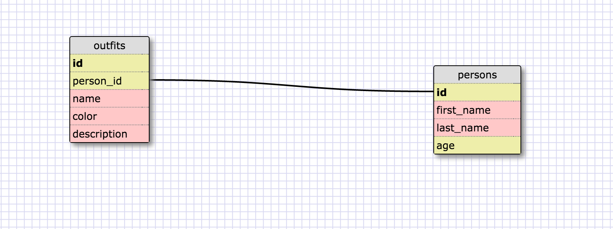

1.
SELECT *
FROM states;

2.
SELECT *
FROM regions;

3.
SELECT
  state_name,
  population
FROM
  states;

4.
SELECT
  state_name,
  population
FROM
  states
ORDER BY population DESC;

5.
SELECT
  state_name
FROM
  states
LEFT JOIN
  regions
ON
  states.region_id = regions.id
WHERE region.id = 7;

6.
SELECT
  state_name,
  population_density
FROM
  states
WHERE
  population_density >50
ORDER BY population_density;

7.
SELECT
  state_name
FROM
  states
WHERE
  population between 1000000 and 1500000;

8.
SELECT
  state_name,
  region_id
FROM
  states
LEFT JOIN
  regions
ON
  states.region_id = regions.id
ORDER BY region_id;

9.
SELECT
  region_name
FROM
  regions
WHERE region_name like '%Central%';

10.
SELECT
  region_name,
  state_name
FROM
  states
LEFT JOIN
  regions
ON
  states.region_id = regions.id
ORDER BY region_id;

#What are databases for?
  Databases are for storing and accessing large amounts of data in column and row format.
#What is a one-to-many relationship?
  A one-to-many relationship is when one element of one type maps to many elemtns of a different type. If we think about it in columns, a state column and a region column would have a one to many relationship (one region has many states).
#What is a primary key? What is a foreign key? How can you determine which is which?
  A primary key is unique to a table (ie. it cannot repeat) and is usually a number. A foreign key is a key in a different table that maps to that primary key. You can tell which is which by seeing if it repeats or not.
#How can you select information out of a SQL database? What are some general guidelines for that?
  Normally we type something along the lines of SELECT (variable name) FROM (table name).

  