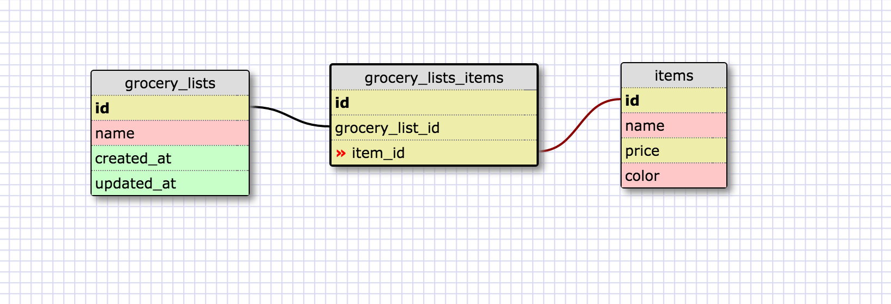
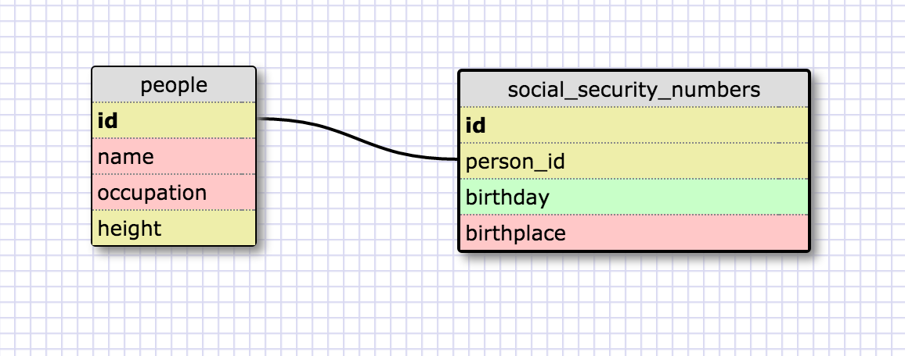

#Release 2:

#Release 4:

#Release 6:
#What is a one-to-one database?
  A one-to-one database is when items can be organized like a pair, so there is exactly one element that maps to another. All tables should have the same number of rows.
#When would you use a one-to-one database? (Think generally, not in terms of the example you created).
  You could use a 1-1 database if you had performance concerns and didn't want to store all your data in one table. You could also use it if you had some fields that were null.
#What is a many-to-many database?
  A many-to-many database is one where multiple rows map to multiple rows in another table
#When would you use a many-to-many database? (Think generally, not in terms of the example you created).
  You could use a many-to-many database to model most relationships where something can occur multiple times in a certain scenario (or region, etc.).
#What is confusing about database schemas? What makes sense?
  Sometimes my first question when thinking about database schemas is why it can't all be in one giant table, but this is probably performance related.